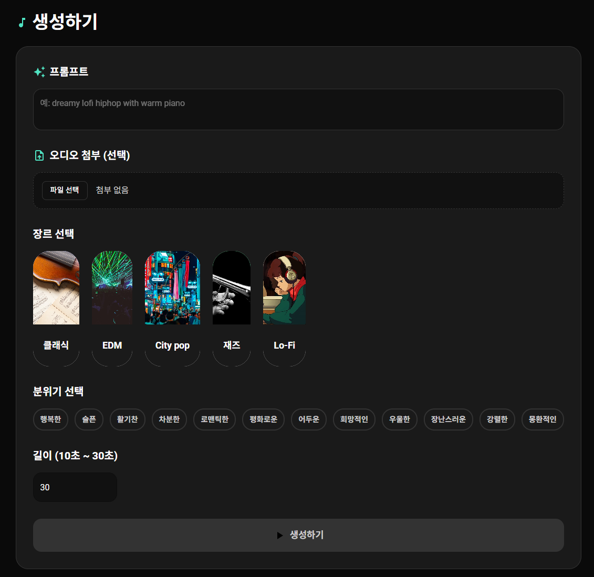

# AI Music Studio

React와 AI를 활용한 웹 기반 음악 생성 및 비트 메이킹 스튜디오입니다.

AI Music Studio는 사용자가 텍스트 프롬프트나 오디오 파일을 기반으로
새로운 음악을 생성하고, 내장된 AI 비트 메이커를 통해 독창적인 드럼
패턴을 만들 수 있는 웹 애플리케이션입니다.



------------------------------------------------------------------------

## 주요 기능

-   **AI 음악 생성**
    -   장르, 분위기, 텍스트 설명을 조합하여 새로운 음악을 생성합니다.\
    -   오디오 파일을 첨부하여 기존 멜로디나 리듬을 기반으로 음악을
        생성할 수 있습니다.
-   **AI 비트 메이커 (Beat Maker)**
    -   Google Magenta의 `MusicVAE` 모델을 활용한 9트랙 드럼 시퀀서를
        제공합니다.\
    -   네 개의 코너 프리셋을 AI로 실시간 블렌딩하여 새로운 비트를
        탐색할 수 있습니다.\
    -   BPM 및 마디 조절, WAV 파일로 내보내기 기능을 지원합니다.
-   **음악 라이브러리**
    -   생성된 모든 음악을 한 곳에서 관리, 재생, 검색 및 필터링할 수
        있습니다.

------------------------------------------------------------------------

## 기술 스택

-   **프론트엔드**: React, React Router, Material-UI (MUI)\
-   **상태 관리**: React Context API\
-   **AI & 오디오**
    -   Hugging Face / Replicate: 텍스트 기반 음악 생성을 위한 백엔드
        API\
    -   @magenta/music & @tensorflow/tfjs: AI 비트 메이커의 핵심
        (MusicVAE)\
    -   Tone.js: 웹 오디오 재생 및 시퀀싱\
-   **백엔드**: Python (Flask), aistudio-music-api\
-   **API**: Papago API (텍스트 번역)

------------------------------------------------------------------------

## 시작하기

### 필수 요구사항

-   Node.js (v16 이상 권장)\
-   npm 또는 yarn\
-   Python 3

### 설치 및 실행

1.  **저장소 클론**

    ``` bash
    git clone https://github.com/your-username/your-repository.git
    cd your-repository
    ```

2.  **프론트엔드 설정** (새 터미널에서 실행)

    ``` bash
    # 의존성 설치
    npm install

    # 개발 서버 실행 (http://localhost:3000)
    npm start
    ```

3.  **백엔드 설정** (다른 새 터미널에서 실행)

    ``` bash
    cd ai-music-backend

    # 가상 환경 생성 및 활성화 (권장)
    python -m venv venv
    source venv/bin/activate  # macOS/Linux
    # venv\Scripts\activate    # Windows

    # 의존성 설치
    pip install -r requirements.txt

    # .env 파일 생성 및 API 키 설정
    # (PAPAGO_CLIENT_ID, PAPAGO_CLIENT_SECRET, REPLICATE_API_TOKEN 등)

    # 서버 실행 (http://localhost:5000)
    python server.py
    ```

이제 브라우저에서 `http://localhost:3000`으로 접속하여 애플리케이션을
사용할 수 있습니다.

------------------------------------------------------------------------

## 프로젝트 구조

이 프로젝트는 React 프론트엔드와 Python Flask 백엔드가 분리된 형태로 구성되어 있습니다.

    /
    ├── ai-music-backend/    # Python Flask 백엔드 서버
    │   ├── server.py        # 메인 API 서버 파일
    │   └── requirements.txt # 백엔드 의존성 목록
    │
    ├── public/              # 정적 파일 (HTML, 이미지 등)
    │
    └── src/                 # React 프론트엔드 소스 코드
        ├── components/      # 재사용 가능한 공용 컴포넌트
        │   ├── beat/        # 비트 메이커 관련 UI (패드, 그리드 등)
        │   └── common/      # 장르/분위기 선택 등 범용 UI
        │
        ├── context/         # 전역 상태 관리 (MusicContext)
        │
        ├── lib/             # 외부 라이브러리 래퍼 (Magenta.js, Tone.js)
        │   └── drumsVAE.js  # MusicVAE 핵심 로직
        │
        ├── pages/           # 페이지 단위 컴포넌트
        │   ├── MusicGeneration.js
        │   ├── MusicConversion.js (BeatMaker)
        │   └── Library.js
        │
        ├── services/        # API 통신 로직 (musicApi.js)
        │
        └── App.js           # 메인 애플리케이션 컴포넌트
